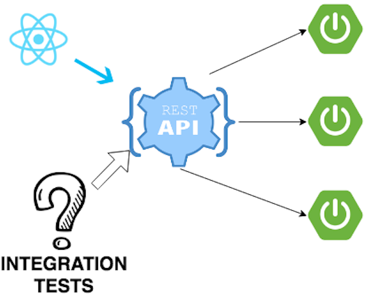
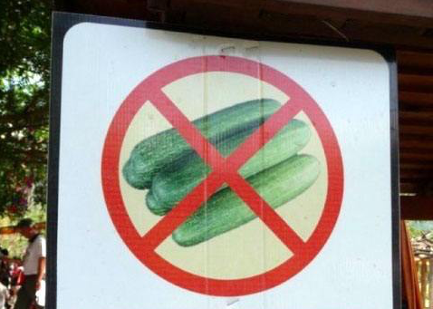
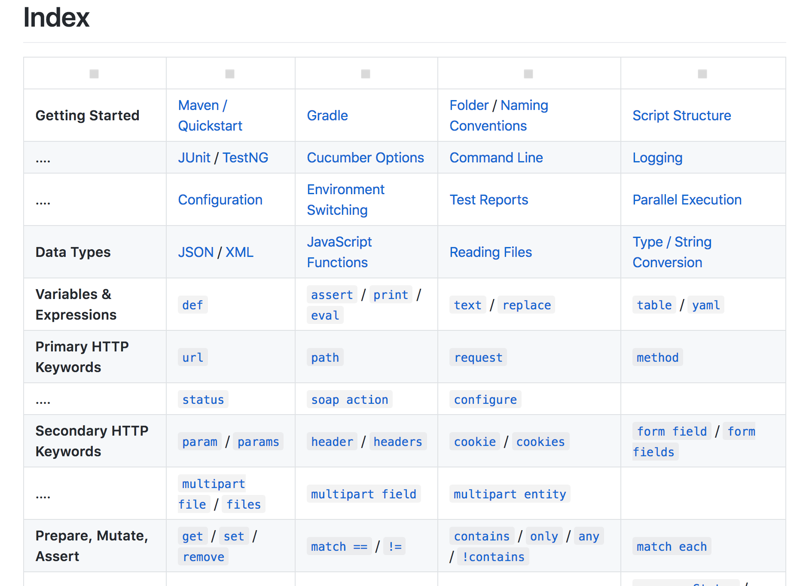
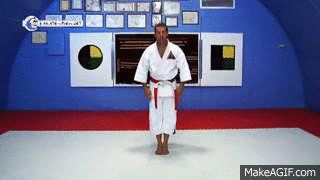

= Ceinture noire `Karate` 🥋 en tests d’API REST
:icons: font
:asset-uri-scheme: https
:source-highlighter: highlightjs
:deckjs_theme: swiss
:deckjs_transition: fade
:navigation: false
:goto: true
:status: true

== Nico et Benoit

icon:twitter[] @NicolasComet +
icon:github[] https://github.com/ncomet +
icon:twitter[] @binout +
icon:github[] https://github.com/binout

image::images/lectra.png[]

== Problématique

== Solution 1 : JaxRs Client

[source, java]
----
@Test
public void should_process_order_and_then_cancel() throws Exception {
    // Create new Order
    final String orderId = IntegrationTestCase.newProductOrderId();

    // Process Order
    final Response response = IntegrationTestCase.newClient().path("/product-orders/" + orderId)
            .request()
            .put(Entity.json("{\"reference\" : \"ABTYD\"}"));
    assertThat(response.getStatusInfo()).isEqualTo(Status.OK);

    // Cancel Order
    final Response response = IntegrationTestCase.newClient().path("/product-orders/" + orderId)
            .request()
            .delete();
    assertThat(response.getStatusInfo()).isEqualTo(Status.NO_CONTENT);
}
----

[canvas-image=images/boring.png]
== Boring

[.canvas-caption, position=bottom-left]
Maintenance et écriture pénible
[.canvas-caption, position=center-left]
Verbeux
[.canvas-caption, position=top-left]
Besoin de commentaires

== Solution 2 : Rest Assured

[source, java]
----
@Test
public void lotto_resource_returns_200_with_expected_id_and_winners() {

  when().
    get("/lotto/{id}", 5).
  then().
    statusCode(200).
      body("lotto.lottoId", equalTo(5),
      "lotto.winners.winnerId", containsOnly(23, 54));
}
----

[canvas-image=images/code.png]
== Boring

[.canvas-caption, position=center-left]
Plus élégant avec un DSL en java
[.canvas-caption, position=bottom-left]
mais reste du code, et encore un peu verbeux

[canvas-image=images/karate-large.png]
== Karate Large

[.canvas-caption, position=bottom-left]
Une autre solution !

== Karate

[quote, Peter Thomas (Intuit)]
Web-Services Testing Made Simple.

icon:github[] https://github.com/intuit/karate (+500 icon:star[])

icon:twitter[] @KarateDSL

* Février 2017 : 1ère release (`0.1.2`)
* Mars 2018 : `0.7.0`

== Hello Cats

image::https://github.com/intuit/karate/raw/master/karate-demo/src/test/resources/karate-hello-world.jpg[]

== Standalone Runner

.Testing `https://cfp.devoxx.fr/`
[source]
----
java -jar karate.jar -t cfp-speaker.feature
----

== Tests avec Karate

DSL `Gherkin` pour écrire des tests d'APIs HTTP MAIS *ce n'est pas du BDD !*

* ✍️ Facile à écrire et à maintenir
* 👌 Pas de _glue_  à coder
* ⏱️ Rapide à exécuter (en parallèle)
* 📄 JSON _first class citizen_

== Démo dans l'IDE

image::images/demo.gif[]

== Documentation

== Pour aller plus loin

* 🤥 Mock Servlet : pas besoin de démarrer un _vrai_ serveur
* 📑 Intégration à Spring REST Docs
* 🔜 Utilisation dans scenario Gatling
* 🖥️ Import scenario Postman
* 🤮 Supporte aussi SOAP (XML) 
* 🤔 Consumer Driven Contracts
** Test Doubles
** Contract Tests

== Questions ?

Le code et les slides : icon:github[]/binout/karate-devoxxfr2018

